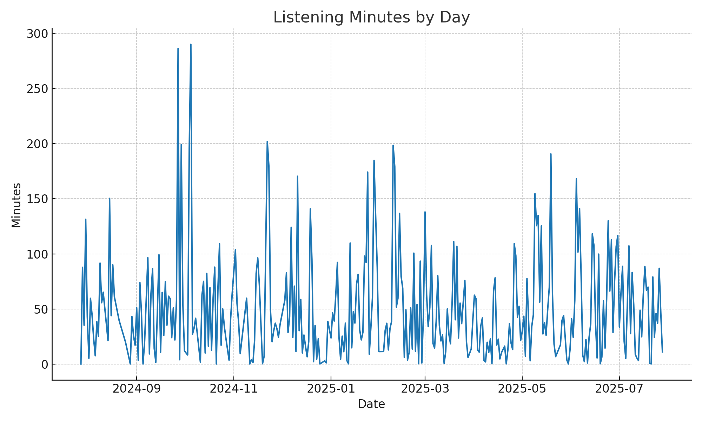

# 🎵 Spotify Data Analytics

This project processes your personal Spotify listening history and generates insights like:

- **Top Artists** (total minutes listened & play counts)
- **Top Tracks** (total minutes listened & play counts)
- **Daily Listening Minutes** (trend over time)
- **Visualizations** (listening minutes by day)

All analysis is done **locally** — your data stays on your machine unless you choose to share it.

---

## 📂 Repository Structure

```
spotify-data-analytics/
├── data/
│   ├── raw/                  # Place your unzipped Spotify export JSONs here (ignored in git)
│   ├── processed/             # Clean processed CSV (streaming_history_clean.csv)
│   └── analytics/             # Output analytics CSVs & daily_minutes.png
├── src/
│   └── process_spotify_data.py  # Script to process Spotify export
├── requirements.txt           # Python dependencies
└── README.md
```

---

## 🚀 Getting Started

### 1️⃣ Request Your Data from Spotify
1. Go to [Spotify Privacy Settings](https://www.spotify.com/account/privacy/).
2. Under **Download your data**, request your **Account data**.
3. When you receive the email from Spotify, download and unzip the archive.

---

### 2️⃣ Install Dependencies
Make sure you have Python 3.x installed.

```bash
pip install -r requirements.txt
```

---

### 3️⃣ Add Your Data
Place all JSON files from your unzipped export inside:
```
data/raw/
```

---

### 4️⃣ Run the Processing Script
```bash
python src/process_spotify_data.py --input data/raw
```

This will:
- Clean and unify the streaming history into `data/processed/streaming_history_clean.csv`
- Generate analytics:
  - `data/analytics/top_artists.csv`
  - `data/analytics/top_tracks.csv`
  - `data/analytics/listening_minutes_by_day.csv`
  - `data/analytics/daily_minutes.png` (visualization)

---

## 📊 Example Outputs

**Top Artists** (minutes listened & plays):
| artist         | minutes | plays |
|----------------|---------|-------|
| Artist A       | 1234.56 | 200   |
| Artist B       | 987.65  | 150   |

**Daily Listening Minutes Plot:**


---

## 🔒 Privacy
This repo **does not** contain personal data by default.  
`data/raw/` is listed in `.gitignore` so your raw Spotify export isn’t committed.

---

## 🛠 Requirements
- Python 3.x
- `pandas`
- `matplotlib`

---

## 📜 License
This project is open-source under the MIT License.  
Feel free to fork and adapt for your own Spotify analytics!
